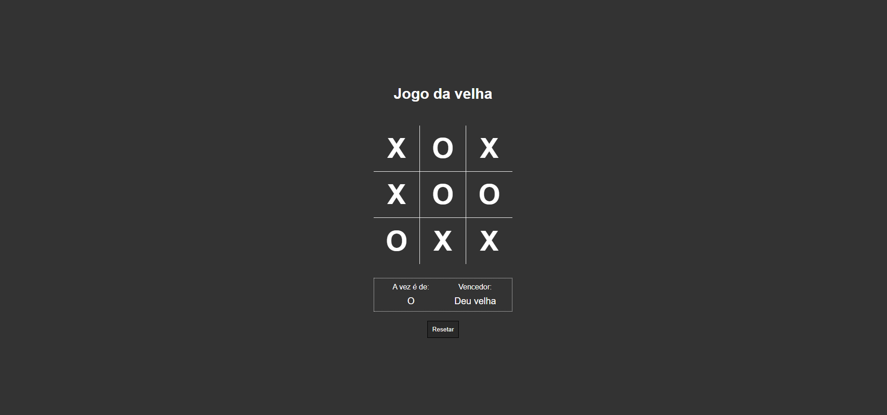

<h1 align="center"> Jogo da Velha </h1>

Jogo da velha produzido com paradigma de programação orientada a objetos. 

 

  

## 🚀 Tecnologias

Esse projeto foi desenvolvido com as seguintes tecnologias:

- HTML e CSS
- JavaScript
- Git e Github

## 💻 Projeto

O Jogo da velha é um projeto desenvolvido principalmente para entretenimento, mas também foi trabalhado com o objetivo de melhorar meus entendimentos sobre POO.

- [Acesse o projeto finalizado, online]()

## Créditos

Feito por Dário Klein & B7WEB.
